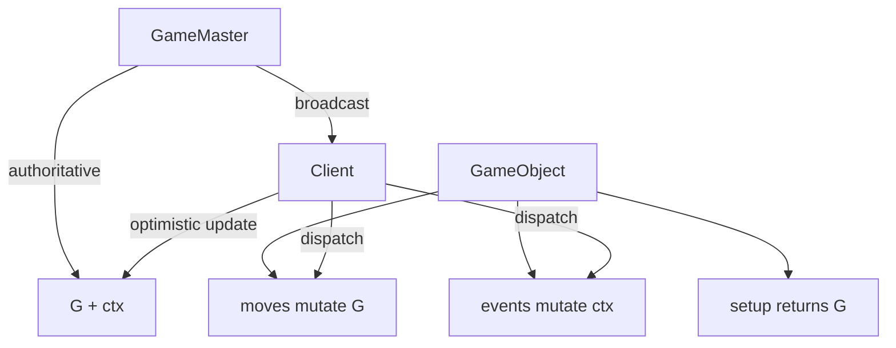
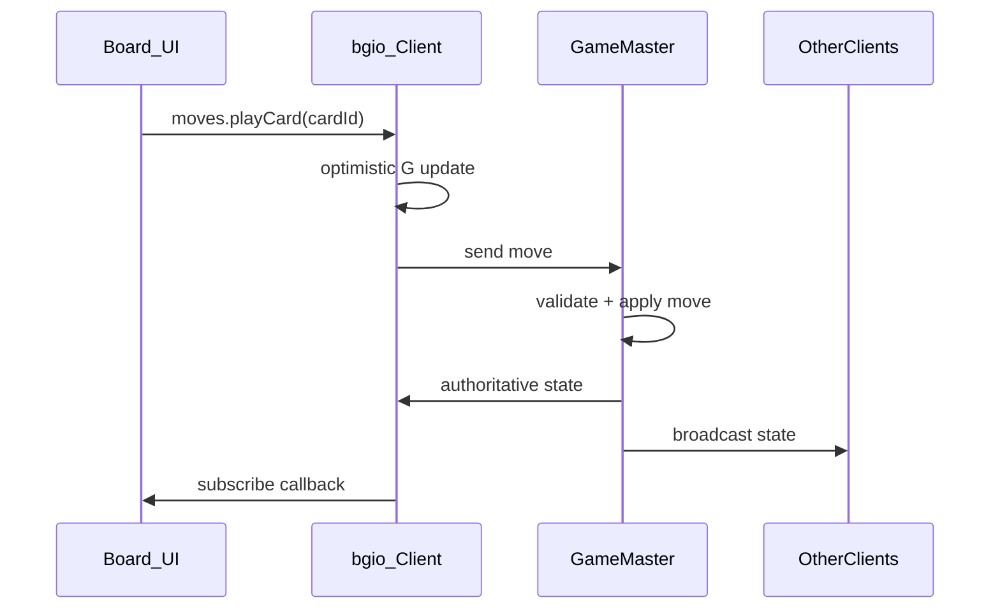

# boardgame.io

Turn-based game framework with an authoritative master, optimistic client updates, and JSON-serializable state. Rules live in the game definition. The client renders and dispatches. The transport (`Local` or `SocketIO`) is a swap, not a second rules engine.

| User goal | boardgame.io approach |
| --- | --- |
| Single-player prototype | `Client({ game })` only |
| Pass-and-play / hot-seat | `multiplayer: Local()` + distinct `playerID` per client |
| Online multiplayer | `SocketIO({ server })` + `Server({ games })` on Node |
| Hidden hands / secret info | `playerView` + `PluginPlayer` |
| AI opponent | `ai.enumerate` + Debug Panel / MCTS |
| Card/deck games | `G` holds deck/hand; moves mutate immutably |



## Workflow

### Step 1: Scaffold

```bash
npm init -y
npm install boardgame.io
```

React client: `boardgame.io/react`. Plain JS: `boardgame.io/client`. Node master: `boardgame.io/server`.

### Step 2: Define the game object

Required: unique `name`, `setup`, `moves`. Optional: `turn`, `phases`, `endIf`, `onEnd`, `playerView`, `plugins`, `ai`.

```ts
import type { Game } from 'boardgame.io';

export const TicTacToe: Game = {
  name: 'tic-tac-toe',
  setup: () => ({ cells: Array(9).fill(null) }),
  turn: { minMoves: 1, maxMoves: 1 },
  moves: {
    clickCell: ({ G, playerID }, id: number) => {
      if (G.cells[id] !== null) return;
      G.cells[id] = playerID;
    },
  },
  endIf: ({ G, ctx }) => {
    // return { winner } | { draw: true } | undefined
  },
};
```

### Step 3: Implement moves

Moves are pure functions on `G`. No `fetch`, no `Date.now()`, no `Math.random()`. Return `INVALID_MOVE` for illegal actions.

```ts
import { INVALID_MOVE } from 'boardgame.io/core';

moves: {
  playCard: {
    move: ({ G, playerID }, cardId: string) => {
      const hand = G.hands[playerID];
      const index = hand.indexOf(cardId);
      if (index === -1) return INVALID_MOVE;
      hand.splice(index, 1);
      G.board.push({ cardId, owner: playerID });
    },
    undoable: false,
    redact: true, // hide args from other clients until resolved
  },
}
```

Long-form fields: `undoable`, `redact`, `client: false` (server-only), `noLimit` (does not consume a move).

### Step 4: Configure turns, phases, stages

- `turn.minMoves` / `turn.maxMoves` auto-end the turn
- `turn.order` controls who is `ctx.currentPlayer`
- `turn.stages` are per-player sub-phases inside a turn
- Phases override config globally; stages override within a turn
- Simultaneous play: `turn.activePlayers: { all: Stage.NULL }` or named stages for both seats

Use `events.endTurn()`, `events.endPhase()`, `events.setStage()` for framework transitions. Do not mutate `ctx`.

### Step 5: Wire the client

```tsx
import { Client } from 'boardgame.io/react';
import { TicTacToe } from './game';
import { Board } from './Board';

const App = Client({ game: TicTacToe, board: Board, debug: true });
```

Dispatch with `props.moves.clickCell(id)` (React) or `client.moves.clickCell(id)` (plain JS). Plain JS must `client.subscribe(() => render(client.getState()))`.

### Step 6: Add multiplayer

**Local master (hot-seat / two seats in one browser):**

```ts
import { Local } from 'boardgame.io/multiplayer';

const App = Client({
  game: TicTacToe,
  board: Board,
  numPlayers: 2,
  multiplayer: Local(),
});

// Mount twice with distinct playerID values, same matchID.
<App matchID="demo" playerID="0" />
<App matchID="demo" playerID="1" />
```

**Remote master:**

```ts
// src/server.ts
import { Server, Origins } from 'boardgame.io/server';
import { TicTacToe } from './game';

const server = Server({
  games: [TicTacToe],
  origins: [Origins.LOCALHOST_IN_DEVELOPMENT],
});
server.run(8000);
```

```ts
import { SocketIO } from 'boardgame.io/multiplayer';

const App = Client({
  game: TicTacToe,
  board: Board,
  numPlayers: 2,
  multiplayer: SocketIO({ server: 'localhost:8000' }),
});
```

Handle `state === null` on first remote connect: early-return until the socket delivers state.



### Step 7: Plugins and secret state

- `Random` plugin: seeded RNG (`random.D6()`, `random.Shuffle(deck)`). Never `Math.random()` in moves.
- `PluginPlayer`: per-player private fields on `G.players[id]`.
- `playerView({ G, ctx, playerID })`: strip hidden hands, facedown identity, deck order. This is a server guarantee, not a CSS hide.

```ts
playerView: ({ G, playerID }) => {
  const hands = { ...G.hands };
  for (const id of Object.keys(hands)) {
    if (id !== playerID) hands[id] = hands[id].map(() => 'hidden');
  }
  return { ...G, hands, deck: G.deck.map(() => 'hidden') };
};
```

### Step 8: Test

- Debug Panel: inspect `G`, `ctx`, dispatch moves/events
- `ai.enumerate` for legal-move bots and MCTS
- Separate terminals for `npm run serve` + client when using `SocketIO`
- Unit-test moves with a headless `Client` from `boardgame.io/client` (no React)

## Core Concepts

- `G` = your game state. `ctx` = framework metadata (turn, phase, currentPlayer, playOrder, gameover).
- `G` must be JSON-serializable: plain objects, arrays, numbers, strings, booleans, null. No classes, functions, Maps, or Sets.
- Moves change `G`. Events change `ctx`.
- `matchID` names a match instance. `playerID` is a seat (`'0'`, `'1'`), not an account.
- Phases are windows where a set of moves is legal. Instantaneous setup (deal, shuffle, score) belongs in hooks (`onBegin`, `onEnd`), not extra phases.

## API Quick Reference

| API | Use |
| --- | --- |
| `setup(ctx, setupData)` | Return initial `G` |
| `moves.foo({ G, ctx, playerID, random }, ...args)` | Mutate `G` or return `INVALID_MOVE` |
| `playerView({ G, ctx, playerID })` | Fog of war; `playerID` is null for spectators |
| `endIf({ G, ctx })` | Truthy value ends the game and becomes `ctx.gameover` |
| `turn.endIf` / `turn.onBegin` / `turn.onEnd` | Per-turn lifecycle |
| `phases.name.onBegin` | Run automatic steps when a phase starts |
| `Server({ games, origins, db })` | Node master; add a storage adapter for persistence |
| `Local()` / `SocketIO({ server })` | Transport only |

Card-game skeleton:

```ts
import { INVALID_MOVE } from 'boardgame.io/core';
import type { Game } from 'boardgame.io';

export const CardGame: Game = {
  name: 'card-game',
  setup: ({ random }) => {
    const deck = random.Shuffle(['A', 'B', 'C', 'D', 'E', 'F']);
    return {
      deck,
      hands: { '0': deck.slice(0, 3), '1': deck.slice(3, 6) },
      board: [],
    };
  },
  moves: {
    playCard: ({ G, playerID }, cardId: string) => {
      const hand = G.hands[playerID];
      const i = hand.indexOf(cardId);
      if (i === -1) return INVALID_MOVE;
      hand.splice(i, 1);
      G.board.push({ cardId, owner: playerID });
    },
  },
  turn: { minMoves: 1, maxMoves: 1 },
};
```

## Multiplayer Patterns

| Mode | Client | Server |
| --- | --- | --- |
| Single player | `Client({ game, board })` | none |
| Local master | `multiplayer: Local()`, two mounts, distinct `playerID`, shared `matchID` | none |
| Remote master | `multiplayer: SocketIO({ server })` | `Server({ games })` |

Remote first-connect: if `G` is null, render a waiting state. Do not assume cells/deck exist.

If both players buy the last shared copy, the first transaction the master commits wins. Validate atomically on the server. Do not use client timestamps.

## Error Handling

| Error / symptom | Cause | Fix |
| --- | --- | --- |
| Move silently ignored | Wrong `playerID` or not current player | Check `ctx.currentPlayer`; set `playerID` on every multiplayer client |
| `INVALID_MOVE` loop | UI still dispatches an illegal action | Guard the UI; validate before dispatch |
| State resets on refresh (remote) | In-memory server storage | Add a persistent storage adapter |
| Client/server desync | `Date.now` or `Math.random` in a move | Use the `random` plugin or a seeded RNG |
| Empty board on load (remote) | `update(null)` before the socket connects | Early-return in subscribe until state exists |
| Cells/deck not updating (plain JS) | Missing `client.subscribe` | Subscribe and re-render on every state change |
| CORS / connection refused | Server down or wrong `origins` | Run `Server`; `origins: [Origins.LOCALHOST_IN_DEVELOPMENT]` in dev |

## Anti-Patterns

| Anti-Pattern | Why | Do Instead |
| --- | --- | --- |
| Mutate `ctx` in moves | Framework owns `ctx` | Use `events.*` |
| Side effects in moves | Breaks replay and sync | Side effects in the client; moves only change `G` |
| Classes/functions in `G` | Breaks serialization | Plain objects and arrays |
| Skipping `name` on the game object | Multi-game server breaks | Always set a unique `name` |
| One client, two players online | Both share a seat | Distinct `playerID` per tab/device |
| `Math.random()` in moves | Desync across clients | `random` plugin with `seed` |
| Giant monolithic `G` | Hard to test | Split deck, hand, board into named fields |
| Hiding secrets only in the UI | Opponent can read the payload | `playerView` on the server |

## 0uroboros conventions

This repo already follows the patterns above. Keep them:

- Game definition: `src/game/OuroborosGame.ts`. Engine modules mutate `G`; the game object only exposes moves and phase hooks.
- Secret state: `src/game/playerView.ts` is authoritative. Do not hide private cards in React alone.
- Phase 1 transport: `Local()` with two `playerID` seats in `src/client/App.tsx`. Remote is `SocketIO()` + `src/server/index.ts`. No rules changes at the swap.
- Instantaneous steps (Location setup, draw, Wave Collapse, cleanup) run in hooks and are recorded on `G.phase`. Only `circuit` and `draft` are move-accepting phases.
- RNG goes through `fromBoardgameRandom`. Timers and Wallet authority become real only on the Node server.

## Sources

- [boardgame.io documentation](https://boardgame.io/documentation/#/)
- [Tutorial (Tic-Tac-Toe)](https://boardgame.io/documentation/#/tutorial)
- [Game API reference](https://boardgame.io/documentation/#/api/Game)
- [Multiplayer guide](https://boardgame.io/documentation/#/multiplayer)
- [Plugins guide](https://boardgame.io/documentation/#/plugins)

## Checklist

- [ ] Game has a unique `name`
- [ ] `G` is JSON-serializable
- [ ] Moves return `INVALID_MOVE` for illegal actions
- [ ] Turn order configured (`minMoves`/`maxMoves` or manual `endTurn`)
- [ ] Multiplayer clients have the correct `playerID` and `matchID`
- [ ] Secret state filtered via `playerView`
- [ ] Server `origins` configured for deployment
- [ ] No `Math.random()` or `Date.now()` inside moves
