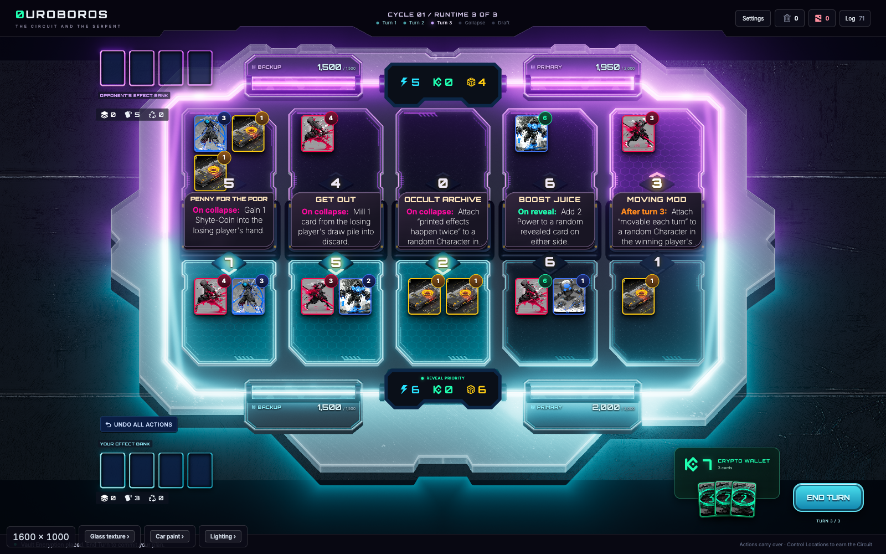
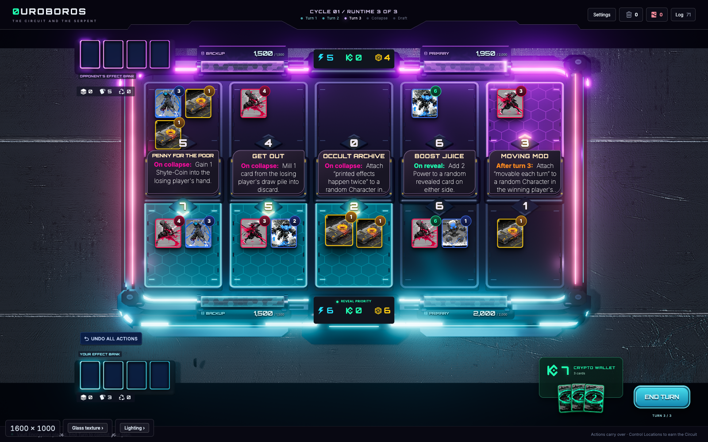

# Classic and Neon board styles

Neon now replaces the complete table presentation: the deck, stepped shell, side blades, front fascia, glass aprons, and lane finishes. **Settings → Board → Board style** selects Classic or Neon; the choice persists across reloads. Classic retains its existing table and side rails.

## Audit and plan

The previous pass changed lanes while retaining the original field wells, lane spines, chassis, and straight rail assemblies. Their rectangular backing remained visible outside the new lane corners. The live rendering stack is React Three Fiber / Three.js, with a warped material-batched GLB, separate Server and Node effects, DOM card/HUD anchors, and one shared HDR post-processing pipeline.

The replacement was planned before major edits in [NEON_REDESIGN_PLAN.md](NEON_REDESIGN_PLAN.md). Lower-cost agents built the geometry and materials separately. Agents who did not implement the product reviewed code, materials/reference alignment, and gameplay readability. Astra integrated the replacement, maintained the Classic branch, and exercised the live game.

## Construction

- **Complete shell:** a stepped, chamfered underbody, recessed glass field, interrupted side blades and custom etched aprons. The near-player apron has broken angular rings, inner hexagons, circuit links and distinct corner sigils; the vertical front face has shaped insets and restrained footlights.
- **Old geometry removal:** Neon keeps only the imported Node bridges/screens, Server mounts, resource housings and Effect Banks. It removes the old lane wells and spines as well as the chassis/perimeter. No source `.blend` or GLB is overwritten.
- **Frosted glass:** one opaque, depth-writing optical surface samples the selected floor image or video through a shared Gaussian blur. View-projected UVs keep the transmitted backdrop aligned with the floor. A 256 × 144 two-pass blur updates when a still image changes and at most 24 times per second for video; it never re-renders the full scene. The glass then samples the blurred result once. Two small half-float targets are shared and released when Neon unmounts.
- **Lighting:** colored edge seams, bevel reflections, quiet interior diffusion and restrained etching define the surfaces. Player colors identify the halves; existing Server health and attack/restore signals feed lane and seam lighting. Neon power sockets use dark matte number insets to retain contrast while the winner chevrons glow.
- **Gameplay states:** lane bounds and card/drop/Node/Server anchors remain unchanged. Hover, ownership, winning patterns, mandatory choices, rewards, and closure retain their existing behavior. Neon reward sweeps and closure covers follow its angular lane shape. Classic keeps the original surfaces and rounded sweep.
- **Accessibility and settings:** lane patterns, player colors, Server styles and background selection remain independent. Reduced motion freezes the new decorative sweep/filament animation.

## Review corrections

Independent review drove three material corrections: remove the old backing geometry, uncover the glass and light seams initially hidden by supporting meshes, and replace sparse texture taps that produced ghosted backdrop contours with smooth Gaussian diffusion. Code review also caught React Three Fiber copying shader uniform entries; the materials now update their mounted uniforms, so background changes and health signals reach the GPU. The award sweep was corrected to follow Neon corners, and shader disposal restored when changing styles. A final populated-Collapse review caught excessive magenta bloom in the existing scan: Neon now uses 12% of its original HDR intensity in both the board and HUD overlay. Classic scan intensity, timing, and gameplay callbacks remain unchanged.

## Verification and evidence

- The full 343-test suite passed. A production build and the 16 relevant layout, style, Server and presentation tests passed after the shader/geometry corrections.
- An independent browser probe checks static images, video, None, live material uniforms, simulated lighting health changes, recovery, reduced motion, persisted style selection and repeated switching. This probe changes only lighting debug state; the populated Cycle test exercises real game actions separately.
- Live Cycle comparison: [test script](../scripts/neon-board-review.mjs), [results](evidence/neon-v2-review.json).
- The live test deployed through the regular UI on both sides, reached a 15-card populated board, exercised damage and healing, completed all three turns and Collapse, bought in Draft, and entered Cycle 2. Whole-lane hover selected exactly one Node. No browser or shader errors were recorded.
- After the scan correction, `node scripts/neon-board-review.mjs --closure` repeated all three populated turns and captured [settled lane closure](evidence/neon-v2-closure-settled-seal.png), [all five Nodes closed](evidence/neon-v2-closure-all-sealed.png), and [settled Draft](evidence/neon-v2-closure-draft.png). [Closure results](evidence/neon-v2-closure-review.json). The earlier `neon-v2-collapse.png` records the pre-correction scan; use `neon-v2-closure-collapse.png` for the final appearance.
- Independent surface/settings check: [test script](../scripts/neon-surface-smoke.mjs), [results](evidence/neon-v2-surfaces.json).
- Four Classic-to-Neon switches held resource counts at 192 geometries, 49 textures, 55 shader programs and 300 program references. This includes a check for references accumulating even when the program count stays constant.
- Reference review accepted populated gameplay at 1366 × 900 and 1600 × 1000. The final Gaussian surface resolved visible background ghosting while preserving the layered table and restrained colored seams.
- A supplementary independent visual review accepted the final scan, partially and fully settled seals, and Draft. The moving closure plate has a straight leading edge during its travel; its final clipped outline fits the lane, with no persistent rectangular underside. No remaining code, resource-lifecycle or visual-readability blocker was reported.

At a 1600 × 1000 browser window (1600 × 898 canvas, pixel ratio 1), the identical populated planning state measured 60 fps for both styles. Neon used 238 draw calls and 58,133 triangles, compared with Classic's 206 calls and 134,491 triangles. Neon p95 frame time was 17.6–18.4 ms across repeated samples; Classic was 17.9 ms. The final Collapse pass averaged 60 fps, with p95 frame times of 22.2–24.9 ms. These are local headless-Chrome observations; screenshot capture and browser automation can disturb individual frames.

[Open the side-by-side Classic/Neon comparison](evidence/neon-v2-comparison.png).

## Comparison with the supplied references

The design follows the references' dark glass planes, clipped illuminated borders, angular hardware and precise mystical diagrams. Ornament is concentrated in the gutters and player-facing apron so cards and state indicators remain primary. It deliberately has less decorative HUD text and fewer dense diagrams across the playing surface than the concept images.

The glass diffuses floor media; it is not ray-traced refraction of every board object. Nodes, Server designs, camera and UI anchors remain the established game modules. The result is a complete procedural table treatment, but it does not reproduce the reference renders' cinematic depth of field, dense environmental detail or photographed glass imperfections. Performance figures in the evidence are local browser frame-pacing measurements, not GPU timings or certification on low-end devices.
